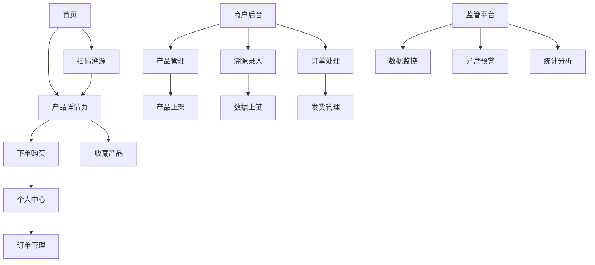

## 1. 产品概述
神农智链是一个基于区块链技术的农产品溯源平台，旨在解决农产品质量安全追溯问题。通过区块链不可篡改的特性，记录农产品从种植、加工到销售的全生命周期数据，为消费者提供可信的溯源服务，帮助农户和商家提升产品信任度和品牌价值。

目标用户包括：消费者、农户、农产品加工企业、监管部门，致力于构建透明可信的农产品供应链生态系统。

## 2. 核心功能

### 2.1 用户角色
| 角色 | 注册方式 | 核心权限 |
|------|----------|----------|
| 消费者 | 手机号/邮箱注册 | 浏览产品、扫码溯源、查看检测报告、评价产品 |
| 农户 | 实名认证+资质审核 | 产品信息录入、溯源数据上传、库存管理、销售统计 |
| 企业用户 | 营业执照认证 | 产品加工信息录入、质检报告上传、订单管理 |
| 监管人员 | 政府账号授权 | 全链路数据监管、异常预警处理、统计分析 |

### 2.2 功能模块
神农智链主要包含以下核心页面：
1. **首页**：产品展示、搜索功能、扫码入口、热门推荐
2. **产品详情页**：产品信息、溯源信息、质检报告、用户评价
3. **个人中心**：用户信息、订单管理、收藏夹、设置
4. **商户后台**：产品管理、溯源数据录入、订单处理、数据统计
5. **监管平台**：数据监控、异常预警、统计分析、企业管理

### 2.3 页面详情
| 页面名称 | 模块名称 | 功能描述 |
|----------|----------|----------|
| 首页 | 搜索栏 | 支持产品名称、产地、品类搜索，扫码溯源快捷入口 |
| 首页 | 产品展示 | 轮播图展示热门产品，分类浏览，推荐算法 |
| 首页 | 扫码功能 | 调用摄像头扫描二维码，跳转对应产品溯源页 |
| 产品详情页 | 基本信息 | 展示产品名称、图片、价格、产地、农户信息 |
| 产品详情页 | 溯源信息 | 时间轴展示种植、采摘、加工、运输各环节数据 |
| 产品详情页 | 质检报告 | 展示农残检测、营养成分等权威检测报告 |
| 产品详情页 | 区块链验证 | 显示区块高度、交易哈希、验证状态 |
| 个人中心 | 用户信息 | 头像、昵称、手机号、收货地址管理 |
| 个人中心 | 订单管理 | 订单列表、物流跟踪、售后服务 |
| 个人中心 | 收藏夹 | 收藏的产品列表、批量管理 |
| 商户后台 | 产品管理 | 产品信息录入、编辑、上下架操作 |
| 商户后台 | 溯源录入 | 按环节录入溯源数据、图片上传、时间记录 |
| 商户后台 | 订单处理 | 新订单提醒、发货管理、订单状态更新 |
| 商户后台 | 数据统计 | 销售额统计、产品热度分析、客户画像 |
| 监管平台 | 实时监控 | 异常数据预警、风险等级评估 |
| 监管平台 | 企业管理 | 企业资质审核、信用评级、违规记录 |
| 监管平台 | 数据分析 | 区域产量分析、质量安全报告、趋势预测 |

## 3. 核心流程

### 消费者流程
用户通过首页搜索或扫码进入产品详情页，查看产品信息和溯源数据，可下单购买或收藏产品。购买后可在个人中心查看订单状态和物流信息。

### 商户流程
商户登录后台，录入产品信息和各环节的溯源数据，上传质检报告。产品上架后，处理用户订单，更新发货状态。定期查看销售数据统计，优化经营策略。

### 监管流程
监管人员登录监管平台，实时监控各环节的异常数据，对预警信息进行处理。定期生成区域质量安全报告，对违规企业进行处罚和整改要求。

## 4. 用户界面设计

### 4.1 设计风格
- **主色调**：绿色（#52C41A）代表生态健康，辅以白色和浅灰色
- **按钮样式**：圆角矩形设计，主要按钮使用渐变色，次要按钮使用边框
- **字体选择**：思源黑体，标题18-24px，正文14-16px，小字12px
- **布局风格**：卡片式布局，清晰的信息层级，充足的留白
- **图标风格**：线性图标，简洁现代，符合农业主题

### 4.2 页面设计概述
| 页面名称 | 模块名称 | UI元素 |
|----------|----------|--------|
| 首页 | 顶部导航 | 绿色背景，白色文字，包含logo、搜索框、用户头像 |
| 首页 | 产品卡片 | 圆角卡片，产品图片占2/3，底部显示价格和产地 |
| 产品详情页 | 图片轮播 | 全屏宽度，支持手势滑动，显示当前页码 |
| 产品详情页 | 溯源时间轴 | 垂直时间线，绿色节点，显示各环节关键信息 |
| 个人中心 | 功能入口 | 宫格布局，图标+文字，点击有波纹效果 |
| 商户后台 | 数据面板 | 图表展示，支持筛选和导出功能 |

### 4.3 响应式设计
- 移动端优先设计，适配320px-768px手机屏幕
- 平板端768px-1024px，采用侧边栏导航
- 桌面端1024px以上，充分利用屏幕空间，多列布局
- 触摸交互优化，按钮最小44px，支持长按操作