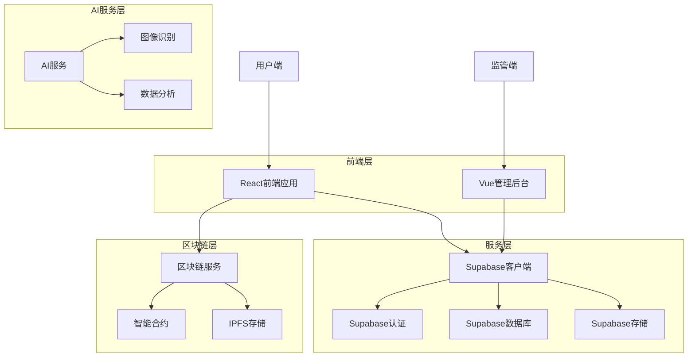
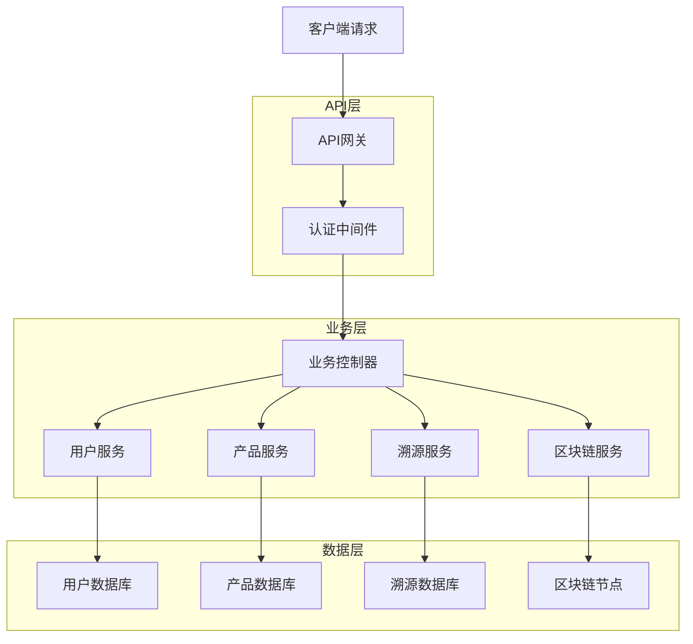
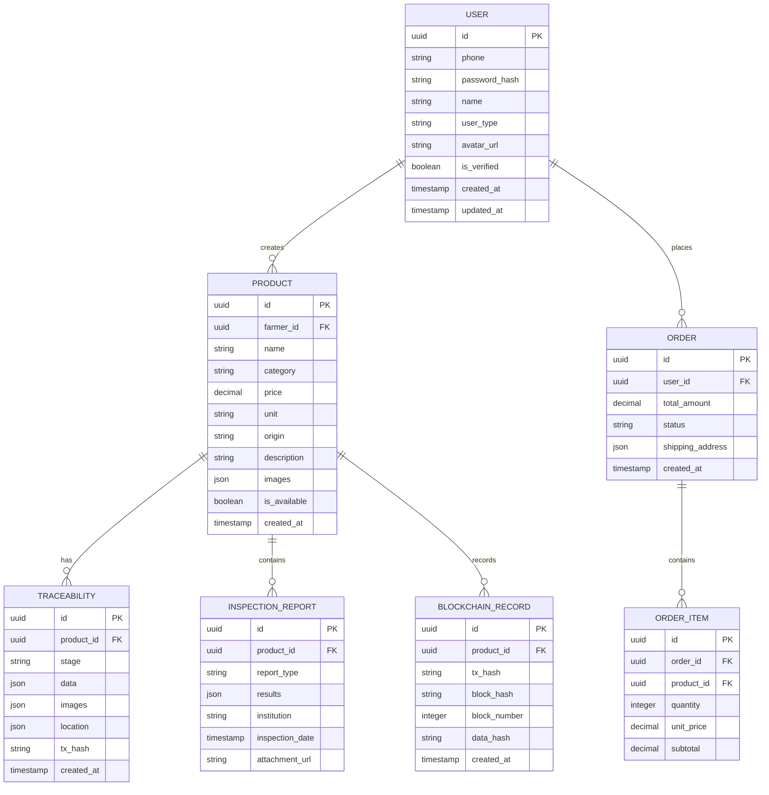

## 1. 架构设计



## 2. 技术描述

- **前端**: React@18 + TypeScript + Vite + TailwindCSS@3
- **移动端**: React Native@0.72 (跨平台移动应用)
- **后端**: Supabase (PostgreSQL数据库、认证、存储)
- **区块链**: Ethereum + Web3.js + 智能合约 (Solidity)
- **文件存储**: IPFS + Supabase存储
- **AI服务**: Python@3.9 + FastAPI + TensorFlow@2.13
- **监控**: Sentry (错误监控) + Google Analytics (用户行为)

## 3. 路由定义

| 路由 | 用途 |
|------|------|
| / | 首页，产品展示和搜索 |
| /product/:id | 产品详情页，展示溯源信息 |
| /scan | 扫码页面，调用摄像头 |
| /profile | 个人中心，用户信息管理 |
| /orders | 订单管理页面 |
| /merchant | 商户后台首页 |
| /merchant/products | 产品管理页面 |
| /merchant/traceability | 溯源数据录入 |
| /merchant/orders | 订单处理页面 |
| /admin | 监管平台首页 |
| /admin/monitoring | 数据监控页面 |
| /admin/enterprises | 企业管理页面 |
| /auth/login | 登录页面 |
| /auth/register | 注册页面 |

## 4. API接口定义

### 4.1 用户认证API

**用户注册**
```
POST /api/auth/register
```

请求参数：
| 参数名 | 类型 | 必填 | 描述 |
|--------|------|------|------|
| phone | string | 是 | 手机号 |
| password | string | 是 | 密码 |
| userType | string | 是 | 用户类型：consumer/farmer/enterprise |
| verifyCode | string | 是 | 短信验证码 |

响应：
```json
{
  "code": 200,
  "message": "注册成功",
  "data": {
    "userId": "uuid",
    "token": "jwt_token"
  }
}
```

**用户登录**
```
POST /api/auth/login
```

请求参数：
| 参数名 | 类型 | 必填 | 描述 |
|--------|------|------|------|
| phone | string | 是 | 手机号 |
| password | string | 是 | 密码 |

### 4.2 产品管理API

**获取产品列表**
```
GET /api/products
```

查询参数：
| 参数名 | 类型 | 必填 | 描述 |
|--------|------|------|------|
| page | number | 否 | 页码，默认1 |
| limit | number | 否 | 每页数量，默认20 |
| category | string | 否 | 产品分类 |
| keyword | string | 否 | 搜索关键词 |

**获取产品详情**
```
GET /api/products/:id
```

**创建产品**
```
POST /api/products
```

请求体：
```json
{
  "name": "有机苹果",
  "category": "水果",
  "price": 15.8,
  "unit": "斤",
  "origin": "山东烟台",
  "description": "优质有机苹果",
  "images": ["url1", "url2"],
  "farmerId": "uuid"
}
```

### 4.3 溯源数据API

**获取溯源信息**
```
GET /api/traceability/:productId
```

**上传溯源数据**
```
POST /api/traceability
```

请求体：
```json
{
  "productId": "uuid",
  "stage": "planting",
  "data": {
    "plantingTime": "2024-03-15",
    "seedVariety": "红富士",
    "fertilizer": "有机肥",
    "pesticide": "无"
  },
  "images": ["url1"],
  "location": {
    "latitude": 37.1234,
    "longitude": 121.5678
  }
}
```

### 4.4 区块链API

**获取链上数据**
```
GET /api/blockchain/transaction/:txHash
```

**验证数据完整性**
```
POST /api/blockchain/verify
```

请求体：
```json
{
  "dataHash": "0x123...",
  "blockNumber": 12345
}
```

## 5. 服务器架构图



## 6. 数据模型

### 6.1 数据模型定义



### 6.2 数据定义语言

**用户表 (users)**
```sql
-- 创建用户表
CREATE TABLE users (
    id UUID PRIMARY KEY DEFAULT gen_random_uuid(),
    phone VARCHAR(20) UNIQUE NOT NULL,
    password_hash VARCHAR(255) NOT NULL,
    name VARCHAR(100) NOT NULL,
    user_type VARCHAR(20) NOT NULL CHECK (user_type IN ('consumer', 'farmer', 'enterprise', 'admin')),
    avatar_url TEXT,
    is_verified BOOLEAN DEFAULT FALSE,
    created_at TIMESTAMP WITH TIME ZONE DEFAULT NOW(),
    updated_at TIMESTAMP WITH TIME ZONE DEFAULT NOW()
);

-- 创建索引
CREATE INDEX idx_users_phone ON users(phone);
CREATE INDEX idx_users_type ON users(user_type);
```

**产品表 (products)**
```sql
-- 创建产品表
CREATE TABLE products (
    id UUID PRIMARY KEY DEFAULT gen_random_uuid(),
    farmer_id UUID NOT NULL REFERENCES users(id) ON DELETE CASCADE,
    name VARCHAR(200) NOT NULL,
    category VARCHAR(50) NOT NULL,
    price DECIMAL(10,2) NOT NULL CHECK (price >= 0),
    unit VARCHAR(20) NOT NULL,
    origin VARCHAR(100) NOT NULL,
    description TEXT,
    images JSONB DEFAULT '[]',
    is_available BOOLEAN DEFAULT TRUE,
    created_at TIMESTAMP WITH TIME ZONE DEFAULT NOW(),
    updated_at TIMESTAMP WITH TIME ZONE DEFAULT NOW()
);

-- 创建索引
CREATE INDEX idx_products_farmer ON products(farmer_id);
CREATE INDEX idx_products_category ON products(category);
CREATE INDEX idx_products_available ON products(is_available);
```

**溯源数据表 (traceability_records)**
```sql
-- 创建溯源数据表
CREATE TABLE traceability_records (
    id UUID PRIMARY KEY DEFAULT gen_random_uuid(),
    product_id UUID NOT NULL REFERENCES products(id) ON DELETE CASCADE,
    stage VARCHAR(50) NOT NULL CHECK (stage IN ('planting', 'growing', 'harvesting', 'processing', 'packaging', 'transporting')),
    data JSONB NOT NULL,
    images JSONB DEFAULT '[]',
    location JSONB,
    tx_hash VARCHAR(66),
    created_at TIMESTAMP WITH TIME ZONE DEFAULT NOW(),
    updated_at TIMESTAMP WITH TIME ZONE DEFAULT NOW()
);

-- 创建索引
CREATE INDEX idx_traceability_product ON traceability_records(product_id);
CREATE INDEX idx_traceability_stage ON traceability_records(stage);
CREATE INDEX idx_traceability_tx ON traceability_records(tx_hash);
```

**区块链记录表 (blockchain_records)**
```sql
-- 创建区块链记录表
CREATE TABLE blockchain_records (
    id UUID PRIMARY KEY DEFAULT gen_random_uuid(),
    product_id UUID NOT NULL REFERENCES products(id) ON DELETE CASCADE,
    tx_hash VARCHAR(66) UNIQUE NOT NULL,
    block_hash VARCHAR(66) NOT NULL,
    block_number INTEGER NOT NULL,
    data_hash VARCHAR(66) NOT NULL,
    created_at TIMESTAMP WITH TIME ZONE DEFAULT NOW()
);

-- 创建索引
CREATE INDEX idx_blockchain_product ON blockchain_records(product_id);
CREATE INDEX idx_blockchain_block ON blockchain_records(block_number);
```

**权限设置**
```sql
-- 授予匿名用户基本查询权限
GRANT SELECT ON users TO anon;
GRANT SELECT ON products TO anon;
GRANT SELECT ON traceability_records TO anon;
GRANT SELECT ON blockchain_records TO anon;

-- 授予认证用户完整权限
GRANT ALL PRIVILEGES ON users TO authenticated;
GRANT ALL PRIVILEGES ON products TO authenticated;
GRANT ALL PRIVILEGES ON traceability_records TO authenticated;
GRANT ALL PRIVILEGES ON blockchain_records TO authenticated;
```

## 7. AI服务设计

### 7.1 图像识别服务
- **农产品识别**: 识别产品种类、成熟度、品质等级
- **病虫害检测**: 通过图像识别农作物病虫害
- **产地识别**: 基于图像特征辅助判断产品产地

### 7.2 数据分析服务
- **价格预测**: 基于历史数据和市场趋势预测产品价格
- **产量预测**: 结合气候数据和种植情况预测产量
- **质量评估**: 综合分析多维度数据评估产品质量等级
- **风险预警**: 识别异常数据，预警潜在质量风险

### 7.3 API接口
```
POST /api/ai/image-recognition
POST /api/ai/price-prediction
POST /api/ai/quality-assessment
GET /api/ai/risk-warning/:productId
```